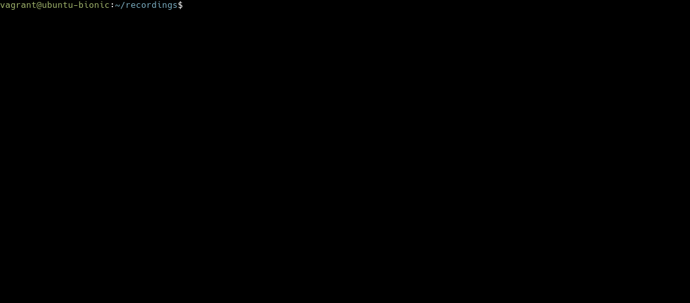
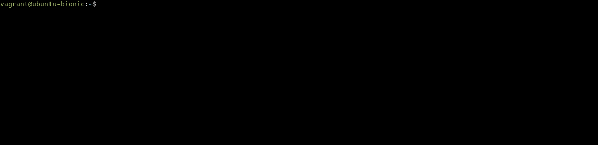

# Cast2Gif

A tool to convert [Asciinema](https://github.com/asciinema/asciinema) cast file to Gif, animated PNG, or SVG files *without* using Electron or a web browser. The discussion on how this project started on a [forum topic](https://users.rust-lang.org/t/writing-an-asciinema-to-gif-tool/39450/15?u=zicklag) on the Rust forum.

## Example Recording

Here is an example of a GIF created with `cast2gif`:

## Full Example

Here is a recording showing how to record a clip with [Asciinema](https://github.com/asciinema/asciinema) and render it with `cast2gif`:

## Features to Add

Here are some features to get in as time permits, ordered by importance:

- Support for changing the output resolution/font-size
- Add a slight bit of padding around the terminal window.
- Automated builds for Windows, Mac, and Linux so users don't have to build it themselves
- Support for custom SVG templates to allow you to style the output
- Support for rendering animated PNGs
- Support for rendering animated SVGs

## Building and Running

To build you must have at least Rust 1.42+ installed. You can install it with [Rustup](https://rustup.rs/). Then Run

    cargo build --release

After that the `cast2gif` program will be in the `target/release` folder.

Run `cast2gif --help` to get the usage instructions:

    cast2gif 0.1.0
    Zicklag <zicklag@katharostech.com>
    Renders Asciinema .cast files as gif, svg, or animated png.

    USAGE:
        cast2gif [FLAGS] <cast_file> <out_file>

    FLAGS:
        -f, --force      Overwrite existing output file
        -h, --help       Prints help information
        -V, --version    Prints version information

    ARGS:
        <cast_file>    The asciinema .cast file to render
        <out_file>     The file to render to
